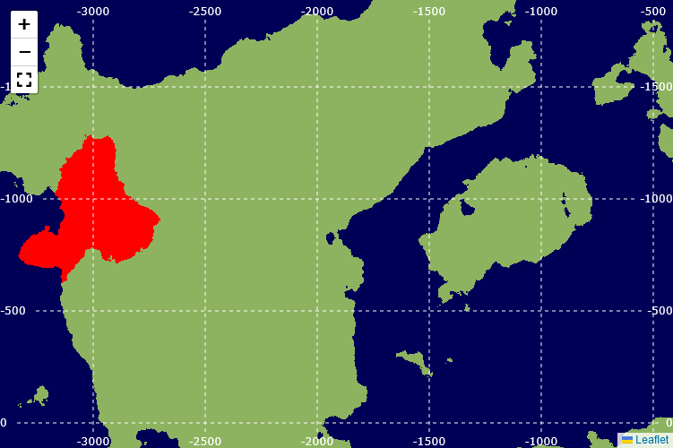

# Monolith Renderer

A tool for visualizing terrain in Minecraft versions `inf-20100611` to
`a1.1.2_01`, including monoliths.

## Usage

The current version of the code is hosted at https://kahomayo.github.io/monolith-renderer/. To run it locally, perform the following steps:

- Install Rust
- Install wasm-pack
- Install node
- Run `wasm-pack build --release` in `monolith-renderer/`
- Run `npm run start` in `monolith-renderer/www/`
- Open `localhost:8080` in your browser.